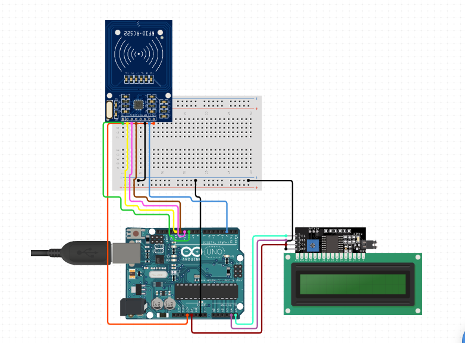

# RFID Attendance System with Arduino and Python
 This project is an RFID-based attendance system using an Arduino UNO, MFRC522 RFID module, I2C LCD display, and Python script for logging attendance data in a MySQL database. The system allows users to sign in and out by scanning their RFID cards, and the attendance data is stored in the MySQL database.
 ## Hardware Requirements
 - Arduino UNO
- MFRC522 RFID module
- I2C LCD display (16x2)
- Buzzer
- LEDs (Green and Red)
- Breadboard
- Jumper wires
 ## Software Requirements
 - Arduino IDE
- Python 3.x
- MySQL Database (e.g., MySQL Server, XAMPP, or WAMP)
- Python libraries:  `pyserial` ,  `mysql-connector-python` 
 ## Installation
 
 1. Install the Arduino IDE from the [official website](https://www.arduino.cc/en/software).
2. Install Python 3.x from the [official website](https://www.python.org/downloads/).
3. Install a MySQL database server. You can use [MySQL Server](https://dev.mysql.com/downloads/mysql/), [XAMPP](https://www.apachefriends.org/download.html), or [WAMP](https://www.wampserver.com/en/).
4. Install the required Python libraries using pip:
pip install pyserial mysql-connector-python
5. Clone or download this repository to your local machine.
 ## Hardware Setup
 1. Connect the MFRC522 RFID module, I2C LCD display, buzzer, and LEDs to the Arduino UNO according to the pin definitions in the  `arduino.ino`  file.
2. Connect the Arduino UNO to your computer using a USB cable.
 ## Software Setup
 1. Open the  `arduino.ino`  file in the Arduino IDE and upload the code to the Arduino UNO.
2. Create a new MySQL database named  `db_arduino`  and import the  `db_arduino.sql`  file provided in the repository.
3. Open the  `Arduino.py`  file in a text editor and update the MySQL database connection credentials (host, user, and password) to match your setup.
4. Update the  `ser = serial.Serial('COM3', 9600)`  line in the  `Arduino.py`  file to match the serial port of your Arduino UNO. You can find the correct port in the Arduino IDE under **Tools > Port**.
 ## Usage
 1. Run the Python script (make sure that you already uploaded the Code to the arduino after that Close any Serial Port that was open or else it wont open) `Arduino.py` :
python Arduino.py
2. Scan an RFID card with the MFRC522 RFID module. The user's name and attendance status (Signed In, Signed Out, or Expired) will be displayed on the I2C LCD display.
3. The attendance data will be logged in the MySQL database, and you can view the attendance records in the  `students` ,  `signin` , and  `signout`  tables.
 ## Customization
 You can customize the RFID card UIDs and corresponding names in the  `Arduino.py`  file by modifying the following lines:

    if uid == '43B4C495':
        name = 'John Miles'
    elif uid == '81934043':
       name = 'Mike Kaze'
    elif uid == '63B001A6':
        name = 'Fujiwara Kaede'
    else:
        name = 'Unknown'
Replace the example UIDs with your own RFID card UIDs and update the names accordingly.